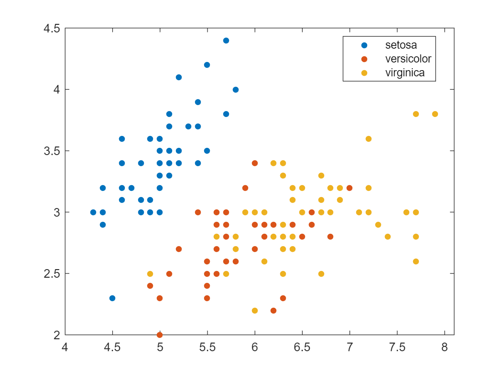
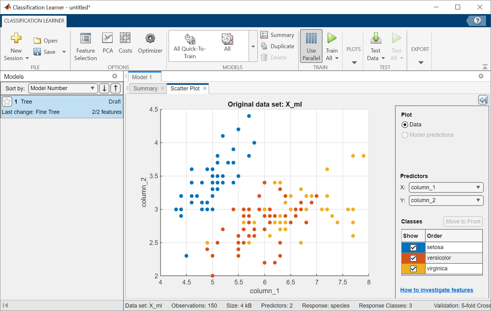

# 5. Call Python AI libraries from MATLAB

In this Chapter we will look at different Python libraries for Artificial Intelligence, both Machine Learning & Deep Learning (like Scikit-learn and TensorFlow) and how to call them from MATLAB.

Those steps can be integrated in a typical [AI workflow](https://www.mathworks.com/discovery/artificial-intelligence.html):


## 5.1. Call Scikit-learn from MATLAB

The Iris flower [dataset](https://en.wikipedia.org/wiki/Iris_flower_data_set) is a multivariate data set introduced by the British statistician and biologist Ronald Fisher. This data set consists of 3 different types of irises’ (Setosa, Versicolour, and Virginica) petal and sepal length, stored in a 150x4 numpy.ndarray. The rows being the samples and the columns being: Sepal Length, Sepal Width, Petal Length and Petal Width.


You can also find this dataset in MATLAB, as it is shipped with a list of [Sample Data Sets](https://www.mathworks.com/help/stats/sample-data-sets.html) as part of the Stats \& Machine Learning Toolbox:


```matlab
load fisheriris.mat
gscatter(meas(:,1),meas(:,2),species)
```





Or retrieve the [dataset](https://scikit-learn.org/stable/auto_examples/datasets/plot_iris_dataset.html) from the Scikit-learn library (inside of MATLAB still):


```matlab
iris_dataset = py.sklearn.datasets.load_iris()
```


```text:Output
iris_dataset = 
  Python Bunch with no properties.

    {'data': array([[5.1, 3.5, 1.4, 0.2],
           [4.9, 3. , 1.4, 0.2],
           [4.7, 3.2, 1.3, 0.2],
           [4.6, 3.1, 1.5, 0.2],
           [5. , 3.6, 1.4, 0.2],
           [5.4, 3.9, 1.7, 0.4],
            ...
           [6.2, 3.4, 5.4, 2.3],
           [5.9, 3. , 5.1, 1.8]]), 
           'target': array([0, 0, 0, 0, 0, 0, 0, 0, 0, 0, 0, 0, 0, 0, 0, 0, 0, 0, 0, 0, 0, 0,
           0, 0, 0, 0, 0, 0, 0, 0, 0, 0, 0, 0, 0, 0, 0, 0, 0, 0, 0, 0, 0, 0,
           0, 0, 0, 0, 0, 0, 1, 1, 1, 1, 1, 1, 1, 1, 1, 1, 1, 1, 1, 1, 1, 1,
           1, 1, 1, 1, 1, 1, 1, 1, 1, 1, 1, 1, 1, 1, 1, 1, 1, 1, 1, 1, 1, 1,
           1, 1, 1, 1, 1, 1, 1, 1, 1, 1, 1, 1, 2, 2, 2, 2, 2, 2, 2, 2, 2, 2,
           2, 2, 2, 2, 2, 2, 2, 2, 2, 2, 2, 2, 2, 2, 2, 2, 2, 2, 2, 2, 2, 2,
           2, 2, 2, 2, 2, 2, 2, 2, 2, 2, 2, 2, 2, 2, 2, 2, 2, 2]), 'frame': None, 'target_names': array(['setosa', 'versicolor', 'virginica'], dtype='<U10'), 'DESCR': '...', 'feature_names': ['sepal length (cm)', 'sepal width (cm)', 'petal length (cm)', 'petal width (cm)'], 'filename': 'iris.csv', 'data_module': 'sklearn.datasets.data'}

```


Scikit-learn datasets are returned as a [Bunch object](https://scikit-learn.org/stable/modules/generated/sklearn.utils.Bunch.html). You can access the Python modules documentation directly from within MATLAB:


 


This dataset can be passed to MATLAB as a struct:


```matlab
struct(iris_dataset)
```


```text:Output
ans = 
             data: [1x1 py.numpy.ndarray]
           target: [1x1 py.numpy.ndarray]
            frame: [1x1 py.NoneType]
     target_names: [1x1 py.numpy.ndarray]
            DESCR: [1x2782 py.str]
    feature_names: [1x4 py.list]
         filename: [1x8 py.str]
      data_module: [1x21 py.str]

```


```matlab
X_np = iris_dataset{'data'}
```


```text:Output
X_np = 
  Python ndarray:

    5.1000    3.5000    1.4000    0.2000
    4.9000    3.0000    1.4000    0.2000
    4.7000    3.2000    1.3000    0.2000
    4.6000    3.1000    1.5000    0.2000
    ...
    5.9000    3.0000    5.1000    1.8000

    Use details function to view the properties of the Python object.

    Use double function to convert to a MATLAB array.

```


```matlab
X_ml = double(X_np)
```


```text:Output
X_ml = 150x4    
    5.1000    3.5000    1.4000    0.2000
    4.9000    3.0000    1.4000    0.2000
    4.7000    3.2000    1.3000    0.2000
    4.6000    3.1000    1.5000    0.2000
    5.0000    3.6000    1.4000    0.2000
    5.4000    3.9000    1.7000    0.4000
    4.6000    3.4000    1.4000    0.3000
    5.0000    3.4000    1.5000    0.2000
    4.4000    2.9000    1.4000    0.2000
    4.9000    3.1000    1.5000    0.1000

```


```matlab
X = X_ml(:,1:2)
```


```text:Output
X = 150x2    
    5.1000    3.5000
    4.9000    3.0000
    4.7000    3.2000
    4.6000    3.1000
    5.0000    3.6000
    5.4000    3.9000
    4.6000    3.4000
    5.0000    3.4000
    4.4000    2.9000
    4.9000    3.1000

```


```matlab
y = iris_dataset{'target'}
```


```text:Output
y = 
  Python ndarray:

   0   0   0   0   0   0   0   0   0   0   0   0   0   0   0   0   0   0   0   0   0   0   0   0   0   0   0   0   0   0   0   0   0   0   0   0   0   0   0   0   0   0   0   0   0   0   0   0   0   0   1   1   1   1   1   1   1   1   1   1   1   1   1   1   1   1   1   1   1   1   1   1   1   1   1   1   1   1   1   1   1   1   1   1   1   1   1   1   1   1   1   1   1   1   1   1   1   1   1   1   2   2   2   2   2   2   2   2   2   2   2   2   2   2   2   2   2   2   2   2   2   2   2   2   2   2   2   2   2   2   2   2   2   2   2   2   2   2   2   2   2   2   2   2   2   2   2   2   2   2

    Use details function to view the properties of the Python object.

    Use int64 function to convert to a MATLAB array.

```


```matlab
% y_ml = int64(y)
```


We won’t translate the Python ndarray into a MATLAB datatype just yet, as we will use a cool feature of Python to translate the list of ordinal values into a list of categorical species. Those features can be leveraged in MATLAB with a few calls to [pyrun](https://www.mathworks.com/help/matlab/ref/pyrun.html)


```matlab
pyrun('dict = {0: "setosa",1: "versicolor", 2: "virginica"}')
s = pyrun('species = [dict[i] for i in y]','species',y = y) % pass y as input, and retrieve species as output
```


```text:Output
s = 
  Python list with values:

    ['setosa', 'setosa', 'setosa', 'setosa', 
    ...
    'versicolor', 'versicolor', 'versicolor', 
    ...
    'virginica', 'virginica', 'virginica']

    Use string, double or cell function to convert to a MATLAB array.

```

Finally, you can retrieve the Python list as a [MATLAB categorical](https://www.mathworks.com/help/matlab/categorical-arrays.html) variable: 


```matlab
s = string(s);
species = categorical(s)
```


```text:Output
species = 1x150 categorical    
setosa       setosa       setosa       setosa       setosa       setosa       setosa       setosa       setosa       setosa       setosa       setosa       setosa       setosa       setosa       setosa       setosa       setosa       setosa       setosa       setosa       setosa       setosa       setosa       setosa       setosa       setosa       setosa       setosa       setosa       

```


Another approach for the preprocessing in Python can be performed with [`pyrunfile`](https://www.mathworks.com/help/matlab/ref/pyrunfile.html)


```matlab
[X,y,species] = pyrunfile('iris_data.py',{'Xl','y','species'})
```


```text:Output
X = 
  Python list with values:

    [[5.1, 3.5], [4.9, 3.0], 
    ... [5.9, 3.0]]

    Use string, double or cell function to convert to a MATLAB array.

y = 
  Python ndarray:

   0   0   0   0   0   0   0   0   0   0   0   0   0   0   0   0   0   0   0   0   0   0   0   0   0   0   0   0   0   0   0   0   0   0   0   0   0   0   0   0   0   0   0   0   0   0   0   0   0   0   1   1   1   1   1   1   1   1   1   1   1   1   1   1   1   1   1   1   1   1   1   1   1   1   1   1   1   1   1   1   1   1   1   1   1   1   1   1   1   1   1   1   1   1   1   1   1   1   1   1   2   2   2   2   2   2   2   2   2   2   2   2   2   2   2   2   2   2   2   2   2   2   2   2   2   2   2   2   2   2   2   2   2   2   2   2   2   2   2   2   2   2   2   2   2   2   2   2   2   2

    Use details function to view the properties of the Python object.

    Use int64 function to convert to a MATLAB array.

species = 
  Python list with values:

    ['setosa', 'setosa', 'setosa', 'setosa', 
    ...
    'versicolor', 'versicolor', 'versicolor', 
    ...
    'virginica', 'virginica', 'virginica']

    Use string, double or cell function to convert to a MATLAB array.

```

This is what the python scripts looks like:

<u>iris_data.py</u>
```python
from sklearn import datasets
iris = datasets.load_iris()

X = iris.data[:, :2]  # we only take the first two features (sepal)
Xl = X.tolist()
y = iris.target
dict = {0: "setosa", 1: "versicolor", 2: "virginica"}
species = [dict[i] for i in y]
```

In this case, we are retrieving a list of lists, instead of a Numpy array. This will require some manual data marshalling:


```matlab
Xc = cell(X)'
```

| |1|
|:--:|:--:|
|1|1x2 list|
|2|1x2 list|
|3|1x2 list|
|4|1x2 list|
|5|1x2 list|
...


```matlab
Xc1 = cell(Xc{1})
```

| |1|2|
|:--:|:--:|:--:|
|1|5.1000|3.5000|


```matlab
cell2mat(Xc1)
```


```text:Output
ans = 1x2    
    5.1000    3.5000

```


The previous steps are included in the helper function `dataprep` (at the end of the live script):

```matlab
function Xp = dataprep(X)
  Xc = cell(X)';
  Xcc = cellfun(@cell,Xc,'UniformOutput',false);
  Xcm = cellfun(@cell2mat,Xcc,'UniformOutput',false);
  Xp = cell2mat(Xcm);
end
```


```matlab
X_ml = dataprep(X);
y_ml = double(y);
s = string(species);
species = categorical(s);
```


Another approach that doesn't involve data transfer is to perform the preprocessing in Python and save the results as [Parquet file](https://www.mathworks.com/help/matlab/parquet-files.html) 


```matlab
pyrunfile('iris_data_save.py')
```


Then, load the Parquet file in MATLAB directly as table


```matlab
T = parquetread("iris.parquet")
```

| |lenght|width|species|
|:--:|:--:|:--:|:--:|
|1|5.1000|3.5000|"setosa"|
|2|4.9000|3|"setosa"|
|3|4.7000|3.2000|"setosa"|
|4|4.6000|3.1000|"setosa"|
|5|5|3.6000|"setosa"|
|6|5.4000|3.9000|"setosa"|
|7|4.6000|3.4000|"setosa"|
|8|5|3.4000|"setosa"|
|9|4.4000|2.9000|"setosa"|
|10|4.9000|3.1000|"setosa"|
|11|5.4000|3.7000|"setosa"|
|12|4.8000|3.4000|"setosa"|
|13|4.8000|3|"setosa"|
|14|4.3000|3|"setosa"|


Call the Scikit-Learn Logistic Regression and its fit and predict methods directly:


```matlab
model = py.sklearn.linear_model.LogisticRegression();
model = model.fit(X,y); % pass by object reference
y2 = model.predict(X);
y2_ml = double(y2);
confusionchart(y_ml,y2_ml)
```


Call the Scikit-Learn model through a wrapper module:


```matlab
model = py.iris_model.train(X,y);
y2 = py.iris_model.predict(model, X)
```


```text:Output
y2 = 
  Python ndarray:

   0   0   0   0   0   0   0   0   0   0   0   0   0   0   0   0   0   0   0   0   0   0   0   0   0   0   0   0   0   0   0   0   0   0   0   0   0   0   0   0   0   0   0   0   0   0   0   0   0   0   2   2   2   1   2   1   2   1   2   1   1   1   1   1   1   2   1   1   1   1   1   1   1   1   2   2   2   2   1   1   1   1   1   1   1   2   2   1   1   1   1   1   1   1   1   1   1   1   1   1   2   1   2   2   2   2   1   2   2   2   2   2   2   1   1   2   2   2   2   1   2   1   2   1   2   2   1   1   2   2   2   2   2   2   1   2   2   2   1   2   2   2   1   2   2   2   1   2   2   1

    Use details function to view the properties of the Python object.

    Use int64 function to convert to a MATLAB array.

```


Precision of the model based on the training set:


```matlab
sum(y_ml == y2)/length(y_ml)
```

```text:Output
ans = 0.8200
```


Alternatively, you can train all sorts of classification models in MATLAB. If you don't feel too comfortable with the various machine learning methods, you can simply try out the results from different types of models with an app:


```matlab
classificationLearner(X_ml,species)
```





## 5.2. Call TensorFlow from MATLAB


Let’s introduce the use of Tensorflow with the [getting started tutorial](https://www.tensorflow.org/tutorials/keras/classification):


This guide uses the [Fashion MNIST](https://github.com/zalandoresearch/fashion-mnist) dataset which contains 70,000 grayscale images in 10 categories. 

The images show individual articles of clothing at low resolution (28 by 28 pixels).

This example is curated by Zalando, under a MIT License.


First let’s **load tensorflow** explicitely, and check the version of tensorflow installed:


```matlab
tf = py.importlib.import_module('tensorflow');
pyrun('import tensorflow as tf; print(tf.__version__)')
```


```text:Output
2.8.0
```


Then let’s **retrieve the dataset**


```matlab
fashion_mnist = tf.keras.datasets.fashion_mnist
```


```text:Output
fashion_mnist = 
  Python module with properties:

    load_data: [1x1 py.function]

    <module 'keras.api._v2.keras.datasets.fashion_mnist' from 'C:\\Users\\ydebray\\AppData\\Local\\WPy64-39100\\python-3.9.10.amd64\\lib\\site-packages\\keras\\api\\_v2\\keras\\datasets\\fashion_mnist\\__init__.py'>

```


```matlab
train_test_tuple = fashion_mnist.load_data();
```


And **store the images and labels** for training and testing separately.


Indexing into [Python tuples in MATLAB](https://www.mathworks.com/help/matlab/matlab_external/pythontuplevariables.html) is done with curly brackets: `pytuple{1}`


(Remember that indexing starts at 1 in MATLAB unlike Python starting at 0)


```matlab
% ND array containing gray scale images (values from 0 to 255)
train_images = train_test_tuple{1}{1}; 
test_images = train_test_tuple{2}{1};
% values from 0 to 9: can be converted as uint8
train_labels = train_test_tuple{1}{2};
test_labels = train_test_tuple{2}{2}; 
```


Define the list of classes directly in MATLAB:


```matlab
class_names = ["T-shirt/top", "Trouser", "Pullover", "Dress", "Coat", "Sandal", "Shirt", "Sneaker", "Bag", "Ankle boot"]
```


```text:Output
class_names = 1x10 string    
"T-shirt/top""Trouser"    "Pullover"   "Dress"      "Coat"       "Sandal"     "Shirt"      "Sneaker"    "Bag"        "Ankle boot" 

```


If we want to use the index of the training labels from the list above in MATLAB, we need to shift the range from [0:9] to [1:10]


```matlab
tl = uint8(train_labels)+1; % shifting range from [0:9] to [1:10]
l = length(tl)
```


```text:Output
l = 60000
```


The following shows there are 60,000 images in the training set, with each image represented as 28 x 28 pixels:


```matlab
train_images_m = uint8(train_images);
size(train_images_m)
```


```text:Output
ans = 1x3    
       60000          28          28

```


To **resize a single image** from the dataset, use the reshape function:


```matlab
size(train_images_m(1,:,:))
```


```text:Output
ans = 1x3    
     1    28    28

```


```matlab
size(reshape(train_images_m(1,:,:),[28,28]))
```


```text:Output
ans = 1x2    
    28    28

```


You can add a live control to your live script to **explore your dataset**:


```matlab
i = 42;
img = reshape(train_images_m(i,:,:),[28,28]);
imshow(img)
title(class_names(tl(i)))
```


You must **preprocess the data** before training the network. 


If you inspect the first image in the training set, you will see that the pixel values fall in the range of 0 to 255:


```matlab
train_images = train_images / 255;
test_images = test_images / 255;
```


Finally, **build and train the model** with the function specified in the tf_helper file / module:


```matlab
model = py.tf_helper.build_model();
```


You can look at the architecture of the model by retrieving the layers in a cell array:


```matlab
cell(model.layers)
```

| |1|2|3|
|:--:|:--:|:--:|:--:|
|1|1x1 Flatten|1x1 Dense|1x1 Dense|


```matlab
py.tf_helper.compile_model(model);
py.tf_helper.train_model(model,train_images,train_labels) 
```


```text:Output
Epoch 1/10

   1/1875 [..............................] - ETA: 12:59 - loss: 159.1949 - accuracy: 0.2500
  39/1875 [..............................] - ETA: 2s - loss: 52.8977 - accuracy: 0.5256    
  76/1875 [>.............................] - ETA: 2s - loss: 34.8739 - accuracy: 0.6049
 113/1875 [>.............................] - ETA: 2s - loss: 28.4213 - accuracy: 0.6350
 157/1875 [=>............................] - ETA: 2s - loss: 22.9735 - accuracy: 0.6616
 194/1875 [==>...........................] - ETA: 2s - loss: 20.3405 - accuracy: 0.6740
 229/1875 [==>...........................] - ETA: 2s - loss: 18.3792 - accuracy: 0.6861
 265/1875 [===>..........................] - ETA: 2s - loss: 16.7848 - accuracy: 0.6943

 ...
```


**Evaluate the model** by comparing how the model performs on the test dataset:


```matlab
test_tuple = py.tf_helper.evaluate_model(model,test_images,test_labels)
```


```text:Output
313/313 - 0s - loss: 0.5592 - accuracy: 0.8086 - 412ms/epoch - 1ms/step
test_tuple = 
  Python tuple with values:

    (0.5592399835586548, 0.8086000084877014)

    Use string, double or cell function to convert to a MATLAB array.

```


```matlab
test_acc = test_tuple{2}
```


```text:Output
test_acc = 0.8086
```


**Test the model** on the first image from the test dataset:


```matlab
test_images_m = uint8(test_images);
prob = py.tf_helper.test_model(model,py.numpy.array(test_images_m(1,:,:)))
```


```text:Output
prob = 
  Python ndarray:

    0.0000    0.0000    0.0000    0.0000    0.0000    0.0002    0.0000    0.0033    0.0000    0.9965

    Use details function to view the properties of the Python object.

    Use single function to convert to a MATLAB array.

```


```matlab
[argvalue, argmax] = max(double(prob))
```


```text:Output
argvalue = 0.9965
argmax = 10
```


```matlab
imshow(reshape(test_images_m(1,:,:),[28,28])*255)
title(class_names(argmax))
```


